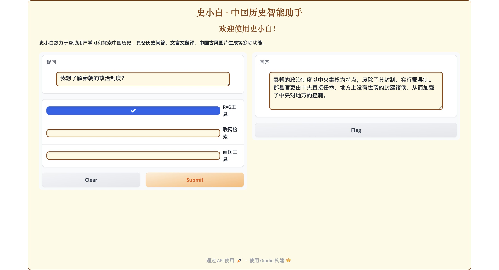
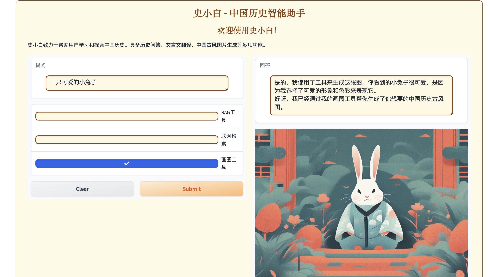

# 史小白 - 中国历史智能助手

## 项目Logo


## 项目简介

**史小白**是一个智能历史助手，旨在帮助用户探索和学习中国历史。项目基于[InternLM](https://github.com/InternLM/Tutorial)大模型技术，提供了多种功能，包括：

- **历史问答**：用户可以提出中国历史相关的问题，史小白将提供详细且准确的回答。
- **文言文翻译**：能够将古代文献翻译成现代汉语，方便用户理解文言文。
- **中国古风图片生成**：根据用户的需求生成具有中国古代风格的图片，增强历史学习的趣味性。

通过整合现代人工智能技术，史小白致力于为历史爱好者提供一个便捷的学习平台。

## 功能模块

- **历史知识问答**：利用自然语言处理技术，回答关于中国历史的复杂问题。
- **文言文翻译**：通过AI模型实现文言文的自动翻译，方便用户理解古文。
- **古风图片生成**：通过图片生成技术，用户可以生成独具特色的中国古风图像。

## 项目架构

项目架构图如下所示：


## 项目运行结果

项目运行后的结果示例：

### **1. RAG检索效果**



### **2. 画图Agent**



## 安装与运行

### 1. 克隆仓库

首先，将项目克隆到本地：

```bash
git clone https://github.com/colorfulandcjy0806/shixiaobai.git
```

### 2. 安装依赖

使用以下命令安装项目所需依赖：

```bash
pip install -r requirements.txt
```

或者你也可以根据`packages.txt`文件中的包手动安装。

### 3. 运行项目

运行以下命令启动项目：

```bash
python app.py
```

## 文件结构

```bash
ShiXiaobai-Intelligent-History-Assistant/
│
├── LICENSE                    # 开源协议文件
├── README.md                  # 项目说明文件
├── app.py                     # 项目的主程序
├── logo.png                   # 项目Logo
├── 技术路线图.png              # 项目架构图
├── 运行结果.jpg                # 项目运行后的示例截图
├── packages.txt               # 手动安装依赖的包列表
└── requirements.txt           # 使用pip安装的依赖
```

## 发布地址
- [B站 【大模型项目】史小白——中国历史智能助手](https://www.bilibili.com/video/BV1ijW6eoE91/?share_source=copy_web)
- [OpenXLab项目地址](https://openxlab.org.cn/models/detail/chenjunyang/ShiXiaobai_history)

## 参考资料

- [InternLM GitHub 仓库](https://github.com/InternLM/Tutorial)
- [项目报名链接](https://aicarrier.feishu.cn/wiki/DjY6whCO0inTu2kQN9Cchxgynme)

## 贡献指南

欢迎任何对本项目感兴趣的开发者参与贡献。请在提交PR前确保所有测试通过，并遵循代码风格指南。

## 开源协议

本项目使用Apache License，详情请参见 [LICENSE](./LICENSE) 文件。
